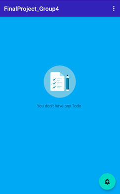
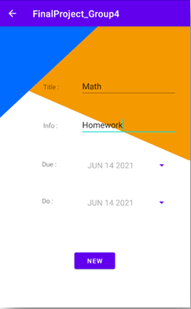
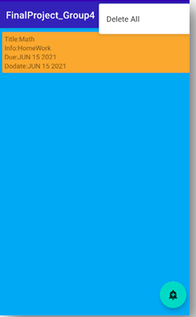
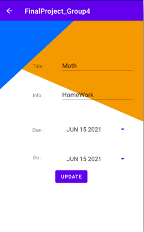

# Todo App

# 專案說明

### 專案動機

- 在修習了基本的Android原生開發後，想要製作一款能實際的應用到我日常生活中的一個App，而我覺得每天要好好的規劃代辦事項，是一件非常重要的事情，因此這款簡單的代辦事項App就誕生了。

### 專案摘要

- 本專案使用Android Studio進行開發，使用原生的Java結合Sqlite來開發應用程式

### 環境安裝

- 使用AndroidStudio安裝AVD(安卓模擬器)，開啟專案並點擊運行

### UI設計

- 當首頁沒有任何代辦事項
    
    
    
- 右下角新增代辦事項
    
    
    
- 首頁出現該事項
    
    
    
    - 可以透過左滑右滑刪除
    - 或者按右上角一次清除
- 點進項目進行修改
    
    
    
- 實際Demo
    - https://youtu.be/8sqw8eUqi7M
